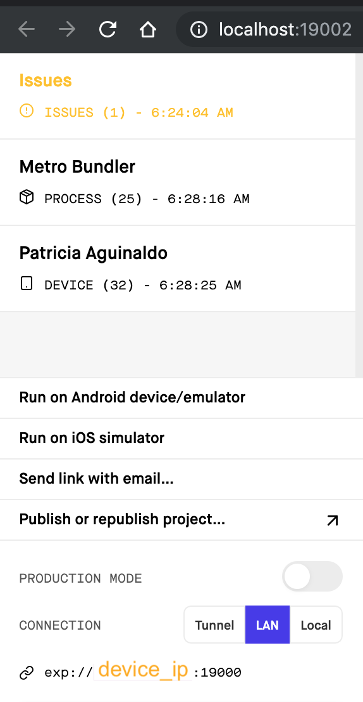

# expo-cli blank template

- [client repo](https://github.com/kronicle114/kitty_mobile_typescript)
- [server repo](https://github.com/kronicle114/kitty_mobile_server)

## tech stack

- **front-end:**
  - [react](https://reactjs.org)
  - [react-native](https://facebook.github.io/react-native/)
  - [typescript](https://www.typescriptlang.org/)
- **back-end:**
  - [node](https://nodejs.org/en/)
  - [express](https://expressjs.com/)
  - [mongodb](https://www.mongodb.com/)
- **dev tools**
  - [Expo CLI](https://docs.expo.io/versions/latest/workflow/expo-cli/)

## dev instructions

**Pre-reqs**

- Yarn 1.16.0
- Npm 6.9.0
- Node v10.16.0
- Expo 2.20.2

1. Clone both the server and client side of this app:

- [Client](https://github.com/kronicle114/kitty_mobile_typescript.git) or `git clone https://github.com/kronicle114/kitty_mobile_typescript.git`
- [Server](https://github.com/kronicle114/kitty_mobile_server.git) or `git clone https://github.com/kronicle114/kitty_mobile_server.git`

2. `yarn install` the requirements on each of the repos
3. Run `mongod` in a separate terminal shell.
4. Make sure you have expo-cli on your device or have an ios/android emulator
5. Open a new terminal shell and then `cd` into the server side and run `npm start`. Do the same thing for the client side (`cd` into client side & `npm start`).
6. If successful, the app should load into expo-cli.

# Basics

### Frontend setup

- [x] react-native basics
- [x] typescript
- [x] version control (git/github)
- [x] navigation set up
- [] loader
- [] hook up API actions (login, register)

### Backend setup

- [x] mongodb
- [x] boiler NODE/Express
- [x] user models & auth
- [] CRUD REST API
  - [x] start w/ POST & GET cats
  - [x] prob want a models for that
- [] connect backend to frontend
  - [] render data from server to client
  - [] get a successful login using redux
- [] deploy ios
- [] props & state
- [] redux

### Testing

- [x] added dependencies (enzyme, jest, react-adapters, typescript stuff)
- [] front-end next, catch, input validations
- [] backend user validations, duplicates on unique documents, error handlers

## Front-end

- styles
- [WIP] navbar
- gestures

## Features/User Story

- User should be able to register with form validation
- User should be able to login using persisting auth
- User should be able to logout and login with data persisting
- User should be able to add, edit, delete cat cards
- There should be loading screens/images when an action is performed
- There should be basic navbar
- User should be able to search a particular cat

## v2

- Advanced filter (with tags)
- websocket (chat support)
- notifications (in app & email)
- upload pdf, other doc support
- connect stripe

## Resources

- [Blank Template YouTube](https://www.youtube.com/watch?v=gYN0Rn0BhQI&feature=youtu.be)
- [Using TypeScript with React Native · React Native](https://facebook.github.io/react-native/blog/2018/05/07/using-typescript-with-react-native)
- [The Starter App, Part 1: Project Setup - Matteo Mazzarolo - Medium](https://medium.com/@mmazzarolo/the-starter-app-part-1-project-setup-9b1579a8efa9)
- [Login Screen w/ Typescript Tutorial](https://medium.com/@mmazzarolo/the-starter-app-part-2-login-screen-ui-2937e9a9083b)
- [Configure Typescript](https://medium.com/@sgroff04/configure-typescript-tslint-and-prettier-in-vs-code-for-react-native-development-7f31f0068d2)
- [Markdown Guide](https://guides.github.com/features/mastering-markdown/)
- [Navigation Set up](https://medium.com/@jan.hesters/building-a-react-native-app-with-complex-navigation-using-react-navigation-85a479308f52)

## debug

- 4 jul 19 || ERROR on `npm install axios` fixed by getting access on npm directory `sudo chown -R <whoami> ~/.npm`

```bash
npm ERR! path /Users/trisha/.npm/_cacache/index-v5/d5/82/283d353be571fd3a81096d7e8fa03e8fe25ad7cbf9370dbcca196d4f709b
npm ERR! code EACCES
npm ERR! errno -13
npm ERR! syscall open
npm ERR! Error: EACCES: permission denied, open '/Users/trisha/.npm/_cacache/index-v5/d5/82/283d353be571fd3a81096d7e8fa03e8fe25ad7cbf9370dbcca196d4f709b'
```

- 4 jul 19 || 'Network Request Failed` Error fixed follow steps I wrote [here](https://stackoverflow.com/a/56892222/10219601)
- 4 jul 19 || [cannot use dotenv](https://github.com/motdotla/dotenv/issues/268) fixed via medium article I wrote [here]()

- 13 jul 19 || [Navigator Common Mistakes](https://reactnavigation.org/docs/en/common-mistakes.html)
- 13 jul 19 || PENDING FIX DrawItemProps

```
Argument of type '{ contentComponent: ComponentType<Pick<NavigationInjectedProps<NavigationParams>, never> & { onRef?: ((instance: BurgerMenu | null) => void) | RefObject<BurgerMenu> | null | undefined; }>; }' is not assignable to parameter of type 'DrawerNavigatorConfig'.
  Types of property 'contentComponent' are incompatible.
    Type 'ComponentType<Pick<NavigationInjectedProps<NavigationParams>, never> & { onRef?: ((instance: BurgerMenu | null) => void) | RefObject<BurgerMenu> | null | undefined; }>' is not assignable to type 'ComponentClass<DrawerItemsProps, any> | FunctionComponent<DrawerItemsProps> | undefined'.
      Type 'ComponentClass<Pick<NavigationInjectedProps<NavigationParams>, never> & { onRef?: ((instance: BurgerMenu | null) => void) | RefObject<BurgerMenu> | null | undefined; }, any>' is not assignable to type 'ComponentClass<DrawerItemsProps, any> | FunctionComponent<DrawerItemsProps> | undefined'.
```

- 14 jul 19 || silent network error when trying to connect be db to fe async calls. And then also a bunch of other stack errors. Fixed by making sure that the DEVICE_IP is the same as the expo-cli

**Steps to reproduce:**

1. Make sure you have a working backend and that testing it on POSTMAN works for each endpoint
2. Run both the server and client app on your machine.
3. Initiate the async call by performing the event/action. In this case, clicking on the login button will fetch some cat data from mongodb.

```bash
  ERROR: node_modules/react-native/Libraries/vendor/core/whatwg-fetch.js:504:29 in onerror
```

**Note:** The error above will only show up if your connection is LAN and your env variables (DEVICE_IP on client) is different from your server side. Simple fix is detailed below.

Tips for debugging:

- Make sure that your device and computer are connected to the same wifi source
- DEVICE_IP needs to be the same as the IP on expo
- Machine IP needs to be whitelisted or 0.0.0.0/0 added (including current address) on the "Network Access". Please note when you add an IP to whitelist, it defaults to `/32` that needs to be ∆ed to `/0`
- When running expo-cli via `yarn start`, choose LAN (it's faster and less messier to debug at this point).


